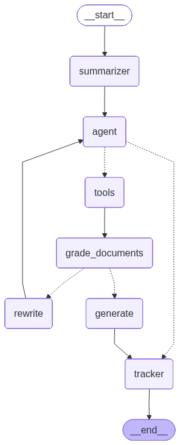

# ⚽ Agente SDR Inteligente - Maringá FC

Este projeto implementa um **Agente de IA SDR (Sales Development Representative)** para o **Maringá Futebol Clube**. O sistema utiliza uma arquitetura avançada de **Adaptive RAG (Retrieval-Augmented Generation)** com **LangGraph** para qualificar leads, tirar dúvidas e impulsionar vendas de planos de sócio-torcedor e produtos oficiais.

## 🎯 Objetivo
Transformar o atendimento digital do Maringá FC em um canal ativo de receitas, utilizando IA para:
1.  🏆 **Vender o Sócio Torcedor (Maringá Paixão)**.
2.  👕 **Vender Produtos da Loja Oficial**.
3.  📝 **Capturar e Qualificar Leads**.
4.  🤝 **Resolver Dúvidas (SAC Nível 1)**.

---

## 🏗️ Arquitetura do Agente (LangGraph)

O agente não segue um fluxo linear simples. Ele utiliza um grafo de estados (**StateGraph**) para tomar decisões dinâmicas, corrigir buscas falhas e garantir a qualidade da resposta.



### Fluxo de Decisão:
1.  **Summarizer:** Resume o histórico da conversa para manter o contexto sem estourar o limite de tokens.
2.  **Agent Router:** Decide a ação com base na intenção do usuário:
    *   *Dúvidas sobre Sócio/Jogos/Clube:* Chama ferramenta de **RAG (Supabase)**.
    *   *Dúvidas sobre Produtos/Camisas:* Chama ferramenta de **Busca na Loja (Tavily)**.
    *   *Conversa fiada/Saudação:* Responde diretamente.
3.  **Tools:** Executa as buscas (Vetorial ou Web).
4.  **Grade Documents:** Avalia se os documentos retornados respondem à pergunta.
    *   *Se Ruim:* Reescreve a pergunta (**Rewrite Question**) e tenta buscar novamente.
    *   *Se Bom:* Segue para geração de resposta.
5.  **Generate Answer:** Gera a resposta final com o contexto validado.
6.  **Lead Tracker:** Extrai dados do usuário (Nome, Telefone, Plano de Interesse) e salva no CRM (Supabase).

---

## 🛠️ Stack Tecnológica

*   **Linguagem:** Python 3.10+
*   **Orquestração de Agentes:** [LangGraph](https://langchain-ai.github.io/langgraph/)
*   **LLM & Embeddings:** OpenAI (GPT-4o, text-embedding-3-small)
*   **Banco Vetorial:** Supabase (pgvector)
*   **Tools:**
    *   *Retrieval:* Busca semântica em documentos do clube.
    *   *Web Search:* Tavily API (Busca na Store oficial).
*   **Ingestão de Dados:**
    *   *Web Crawler:* BeautifulSoup4 (Scraping do site oficial).
    *   *Documentos Locais:* LangChain Text Splitters.
*   **API:** FastAPI (Backend)
*   **Deploy:** Docker & Azure App Service

---

## 📂 Estrutura do Projeto

```
agente-sdr-maringafc/
├── src/
│   ├── agent.py            # Lógica central do LangGraph (Nós, Arestas e Tools)
│   ├── ingestion_web.py    # Crawler do site maringafc.com.br
│   ├── main.py             # API FastAPI para deploy
│   └── visualize_graph.py  # Gera a imagem da arquitetura
├── tests/
│   ├── test_agent_local.py # Testa o agente no terminal (Mock local)
│   └── test_chat_api.py    # Testa o endpoint da API rodando (Simulador de Client)
├── Dockerfile              # Configuração de container
├── requirements.txt        # Dependências do projeto
└── README.md               # Documentação
```

---

## 🚀 Como Executar

### 1. Pré-requisitos
*   Python 3.10+
*   Conta no [Supabase](https://supabase.com/) (com pgvector habilitado).
*   Chave de API da [OpenAI](https://openai.com/).
*   Chave de API do [Tavily](https://tavily.com/) (para busca na loja).

### 2. Configuração
Clone o repositório e crie um arquivo `.env` na raiz:

```env
OPENAI_API_KEY=sk-...
SUPABASE_URL=https://...
SUPABASE_KEY=eyJ...
TAVILY_API_KEY=tvly-...
```

Instale as dependências:
```bash
pip install -r requirements.txt
```

### 3. Ingestão de Dados (Base de Conhecimento)
Popule o banco vetorial com dados do site e arquivos locais:

```bash
# Ingestão do Site Oficial (Crawler)
python src/ingestion_web.py

# Ingestão de Arquivos Locais (data/*.txt)
python src/ingestion.py
```

### 4. Testando o Agente

**Teste Local (Terminal):**
Interaja com o agente diretamente no terminal para validar a lógica.
```bash
python tests/test_agent_local.py
```

**Teste da API:**
Suba o servidor e use o script de teste de chat.
```bash
# Terminal 1: Subir API
uvicorn src.main:app --reload

# Terminal 2: Simular Cliente
python tests/test_chat_api.py
```

### 5. Visualizar Arquitetura
Gere o diagrama atualizado do grafo do agente:
```bash
python -m src.visualize_graph
```

---

## ✅ Status do Projeto

### Fase 1: Dados & Ingestão
- [x] Database Setup (Supabase + pgvector)
- [x] Ingestão de Arquivos Locais (.txt)
- [x] Web Crawler (maringafc.com.br)
- [x] Limpeza de Dados (Remoção de ruídos de scraping)

### Fase 2: Inteligência (LangGraph)
- [x] Arquitetura RAG Adaptativa (Self-Correction)
- [x] Tool: Busca na Loja (Tavily)
- [x] Persona SDR "Dogão" (Foco em vendas)
- [x] Memória de Conversa (Summarization)
- [x] Rastreamento de Leads (Nome/Plano -> CRM)

### Fase 3: Infraestrutura
- [x] API FastAPI
- [x] Dockerização
- [x] Deploy Azure (App Service)
- [ ] CI/CD (GitHub Actions)